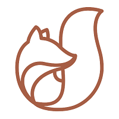
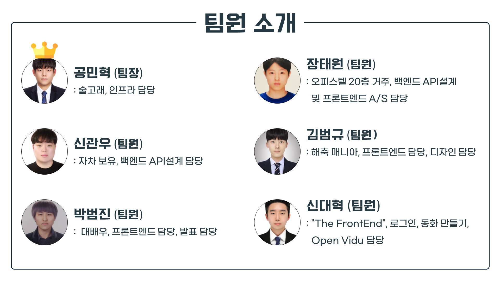
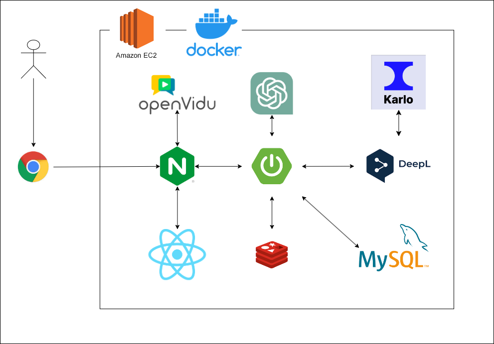
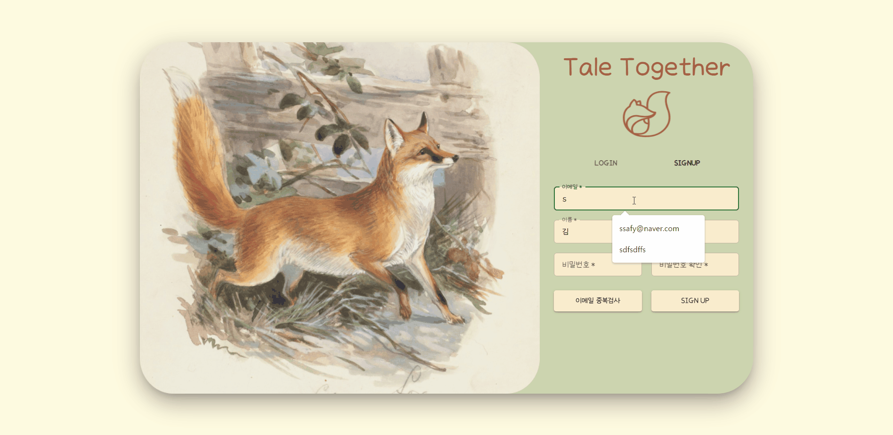
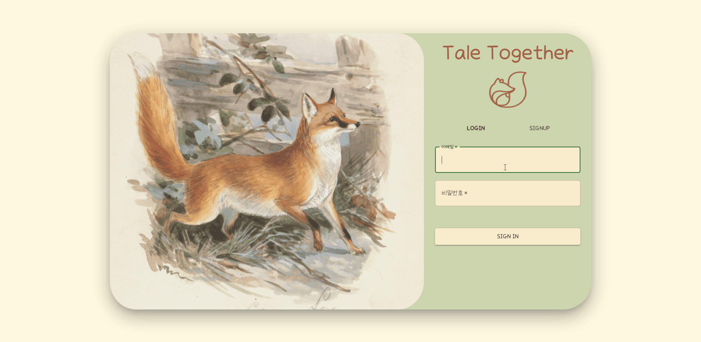
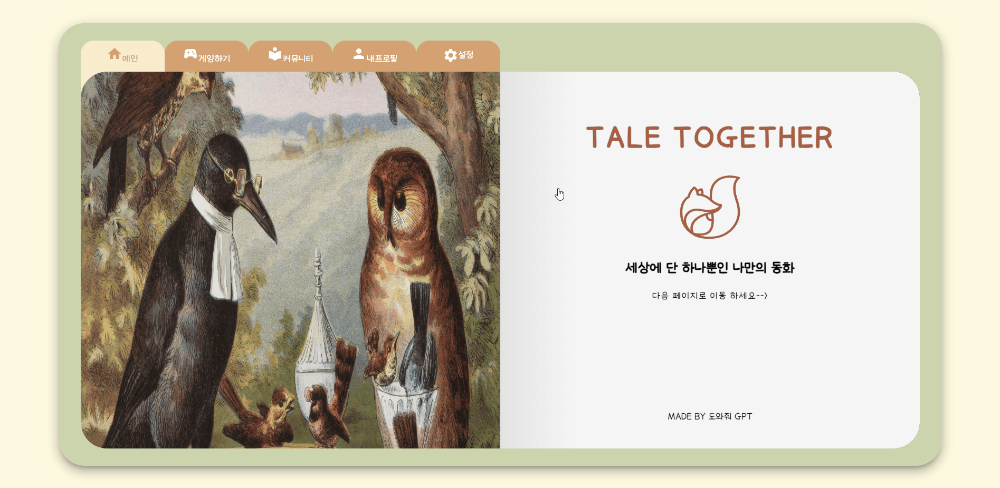
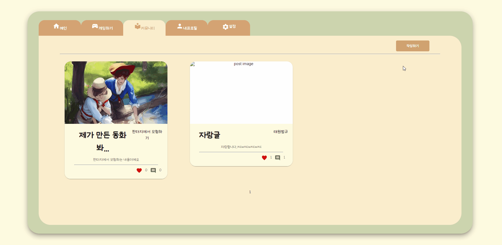
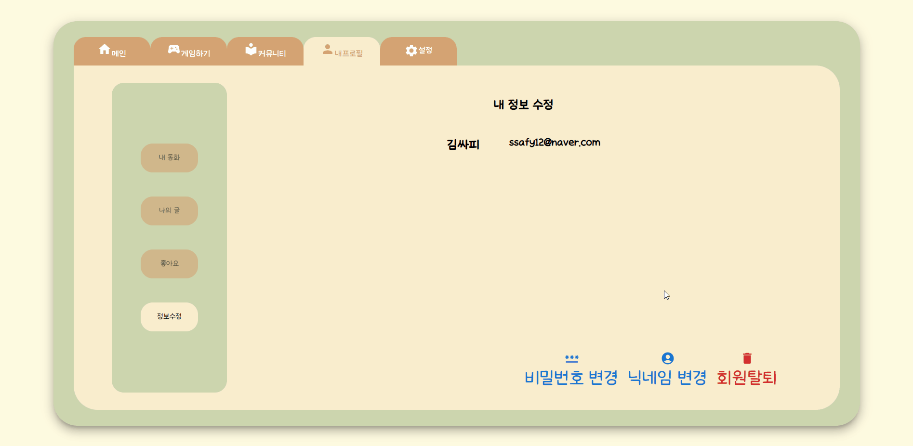

# 함께 만들어가는 나만의 이야기 - Tale Together

<br/>

## :closed_book: 프로젝트 진행기간

2023.07.04(화) ~ 2023.08.18(금) (46일간 진행)

<br/>

## :orange_book: 프로젝트 개요

- #### 배경
  
  현대 사회에서는 조부모와 손자, 손녀 간의 소통의 중요성이 커지고 있으나, 
  대화만으로는 어린 세대의 관심을 얻기가 쉽지 않음.
  현재 조손이 함께 할 수 있는 활동은 매우 제한적.
  양 세대 모두가 공감할 수 있는 주제나 매체가 부족한 상황.

- #### 문제 인식
  
  조손이 함께 즐길 수 있는 활동을 찾는 것이 어려움.
  양 세대 간의 소통을 강화하고 서로의 참여도를 높이기 위한 방안이 필요.

- #### 해결 전략
  
  오락성을 띈 매체를 통해 조손이 함께 즐길 수 있는 플랫폼 구축.
  스토리텔링 형식의 매체 도입을 통해 한쪽이 다른 한쪽을 위해 큰 노력을 기울이지 않아도 될 수 있도록 설계.
  상호작용 게임을 통해 조손간의 소통을 강화하고, 참여도를 증가시키기.
  양방향 통신 기술을 활용하여 거리상의 장애도 극복할 수 있는 소통 방안 마련.

- #### 기대 효과
  
  조손간의 관계 및 소통 향상.
  멀리 떨어져 있는 가족 간의 관계 회복 및 감정적 유대 강화.
  세대 간 갈등 해소 및 서로의 이해도 증진.
  
  이 프로젝트의 목적은 조부모와 손자, 손녀 간의 소통의 중요성을 인식하고, 
  그들 사이의 관계를 더욱 튼튼하게 만들어주는 플랫폼을 제공.
  
  <br/>

## :ledger: 프로젝트 기능

- #### 동화 만들기
  
  ```
  - 방을 만들거나 방의 입장코드를 가지고 게임에 참여할 수 있음.
  - 게임을 시작하면 각 플레이어는 자신의 이름과 성격, 만들고 싶은 동화의 테마를
    입력.
  - 동화는 입력한 정보를 바탕으로 OPEN AI를 이용하여 AI가 생성해주며, 
    플레이어들은 이야기가 진행되는 분기마다 서로 상의하여 선택지를 골라 
    동화를 완성시켜 나감.
  - 각 분기마다 동화의 내용과 만들어진 동화의 내용에 어울리는 그림을 
    KARLO AI를 통해 생성하여 플레이어들은 동화의 진행상황을 알 수 있음.
  - 동화가 끝이나면 '완결하기'버튼을 클릭하여 진행되었던 동화를 요약하여 
    플레이어들은 각각 동화를 소장할 수 있음.
  ```

- #### 커뮤니티
  
  ```
  - 다른 사람이 올린 동화를 보거나 자신이 만든 동화를 자랑할 수 있음.
  - 제목, 내용, 썸네일 이미지를 작성할 수 있음.
  - 글은 한 페이지에 아홉 개씩 저장되며 초과 되면 다음페이지로 넘어감.
  - 작성된 글을 클릭해서 들어가면 그 사람이 올린 동화 전체, 댓글 등 세부 내용을
    볼 수 있음.
  ```

- #### 마이 페이지
  
  ```
  - 자신이 작성한 동화를 다시 꺼내 볼 수 있음.
  - 동화는 한 페이지에 6개씩 저장되며 초과 되면 다음 페이지로 넘어감.
  - 자신이 작성한 게시물을 볼 수 있음.
  - 자신이 좋아요 누른 게시물을 볼 수 있음.
  - 비밀번호 변경, 닉네임 변경, 회원 탈퇴 같은 유저의 정보를 관리함.
  ```
  
  <br/>
  
  ## :green_book: 사용 기술

- #### 프로젝트 관리 도구
  
  - 이슈 관리 : Jira
  
  - 코드 형상 관리 : Gitlab
  
  - 소통 : Mattermost
  
  - 디자인 : Figma

- #### BackEnd
  
  - IntelliJ IDEA
  
  - Visual Studio Code
  
  - Spring Boot 2.7.13
  
  - Spring Security
  
  - Gradle
  
  - JPA
  
  - JVM Amazon Open JDK 11.0.19
  
  - MySql 8.0.3
  
  - Redis

- #### FrontEnd
  
  - Node 18
  
  - React 18
  
  - React Router V6
  
  - React-redux 8.1
    
    Server
  
  - Docker
  
  - NginX
  
  - AWS EC2 Ubuntu 20.04.6 LTS
  
  - WebRTC : openVidu 2.28

- #### 외부 API
  
  - Karlo Api
  
  - OpenAi Api
  
  - DeepL Api

<br/>

## :blue_book: 팀원 소개

 

<br/>

## :notebook_with_decorative_cover: 산출물

- #### 아키텍처



<br/>

## :books: 서비스 화면

### 회원가입



### 로그인



### 메인페이지



### 게임 방생성


### 게임 방참가


### 게임 시작


### 동화 완결


### 커뮤니티 글쓰기



### 커뮤니티 글보기


### 내 동화 보기


### 게시글 보기


### 개인정보 변경

 
